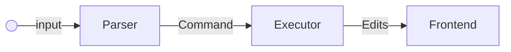

# v1



# Input 
Input is one sentence which will result in one command. (A simplification for now.)

# Parser
Takes input parses it to command.

# Command
```rust
enum Command {
    Write(String),
    Replace {
        old: String,
        new: String,
    },
    Undo,
    Redo,
}
```

# Executor
1. Takes command, and updates the Frontend.

# Frontend
1. For now assumend to be editor.
